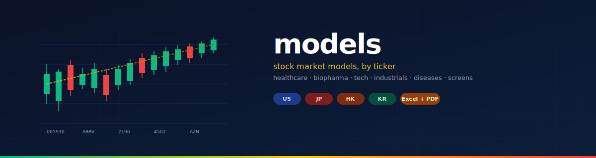
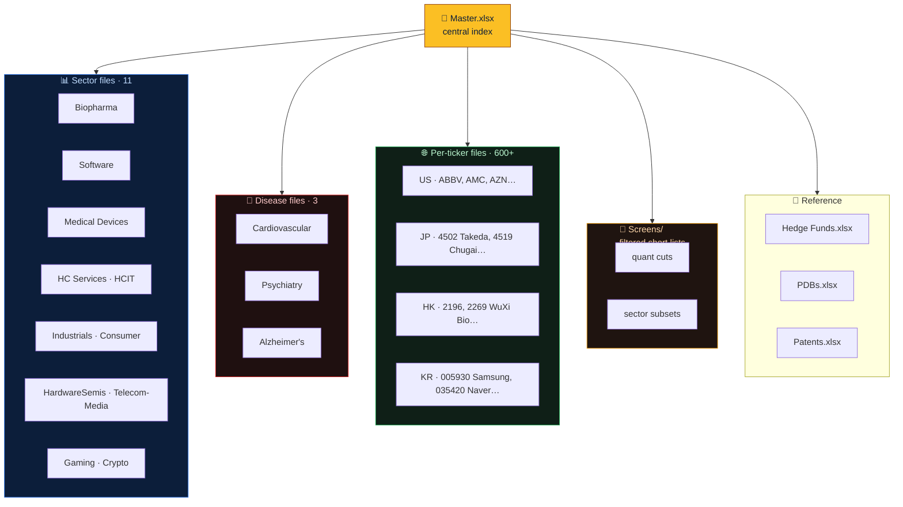
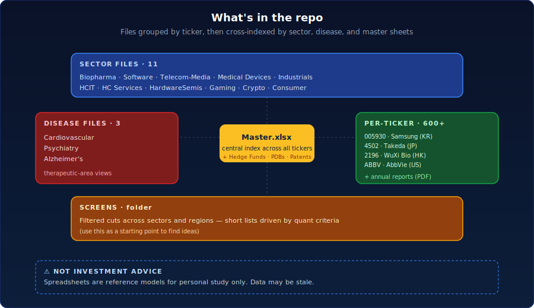

<div align="center">



[](#whats-inside)
[](#per-ticker-files)
[](#sector-files)
[](#disclaimer)
[](./LICENSE)

**A personal reference set of stock market spreadsheets organized by ticker, sector, and therapeutic area.**

</div>

---

## Why this exists

Personal equity research collection. Each ticker gets its own `.xlsx` (and an annual-report PDF when available), with cross-cuts by **sector**, **disease area**, and **screens**. The repo is the long-term filing cabinet behind the analysis — useful as a snapshot, not a live data feed.

---

## What's inside



<div align="center">
  
  <br/>
  <sub><i>Master.xlsx at the center, cross-cuts by sector / disease / region radiating out.</i></sub>
</div>

---

## 🚀 Quick start

Clone and open whichever sheet matches what you're looking for. Everything is plain Excel — no scripts, no setup.

```bash
git clone https://github.com/Anic888/models.git
cd models
open Master.xlsx          # macOS
# or use your spreadsheet tool of choice
```

---

## Sector files

Top-down cuts across the universe. Use these when scanning a whole space.

| File | Coverage |
|------|----------|
| `Biopharma.xlsx` | Large- and mid-cap drug developers |
| `Software.xlsx` | Application + infrastructure software |
| `Telecom-Media.xlsx` | Carriers, broadcasters, streaming |
| `Medical Devices.xlsx` | Diagnostic and therapeutic device makers |
| `Industrials.xlsx` | Industrial conglomerates and machinery |
| `HCIT.xlsx` | Healthcare IT and analytics |
| `HC Services.xlsx` | Hospital systems, payers, services |
| `HardwareSemis.xlsx` | Semiconductors and hardware |
| `Gaming.xlsx` | Gaming publishers and platforms |
| `Crypto.xlsx` | Crypto-adjacent listed names |
| `Consumer.xlsx` | Consumer goods and brands |

---

## Disease files

Therapeutic-area views — used when the relevant unit of analysis is the indication, not the company.

| File | Focus |
|------|-------|
| `Cardiovascular.xlsx` | Heart-failure, lipids, antithrombotics |
| `Psychiatry.xlsx` | Antidepressants, antipsychotics, mood disorders |
| `Alzheimer's.xlsx` | AD-modifying therapies, diagnostics |

---

## Per-ticker files

One spreadsheet per ticker, plus an annual-report PDF where available. Examples by region:

| Region | Examples |
|--------|----------|
| US | `ABBV`, `AMC`, `APLS`, `AZN`, … |
| JP | `4502 Takeda`, `4503 Astellas`, `4519 Chugai`, `4523 Eisai`, `4568 Daiichi Sankyo`, `6758 Sony`, … |
| HK | `1177 Sino`, `1211 BYD`, `1877`, `2196`, `2269 WuXi Biologics`, `3692 Hansoh`, … |
| KR | `005930 Samsung`, `035420 Naver`, `068270 Celltrion`, `207940 Samsung Biologics`, `302440`, … |

Folder-form names (e.g. `068270 Celltrion/`) contain the spreadsheet plus supporting files.

---

## Reference sheets

Cross-sectional data not tied to a single ticker.

| File | Purpose |
|------|---------|
| `Master.xlsx` | Central index across the entire repo |
| `Hedge Funds.xlsx` | Ownership and 13F-style tracking |
| `PDBs.xlsx` | Drug-target / structural reference |
| `Patents.xlsx` | Patent landscape for selected molecules |

---

## Screens

The `Screens/` folder contains short lists generated by quant criteria (revenue growth, margin expansion, pipeline catalysts, etc.). Useful as a starting point to find ideas, not as a recommendation list.

---

## Disclaimer

**Not investment advice.** These spreadsheets are personal reference models for study and analysis only. Data may be stale, incomplete, or wrong. Numbers and notes reflect snapshots from when each file was last touched — verify with primary sources before relying on anything here.

---

## Contributing

Issues and PRs welcome for:

- Correcting factual errors
- Adding regional coverage (EU, LatAm, MENA tickers)
- New therapeutic-area files

---

## License

[MIT](./LICENSE) — the spreadsheets themselves are personal reference; the repository structure and README are MIT.
